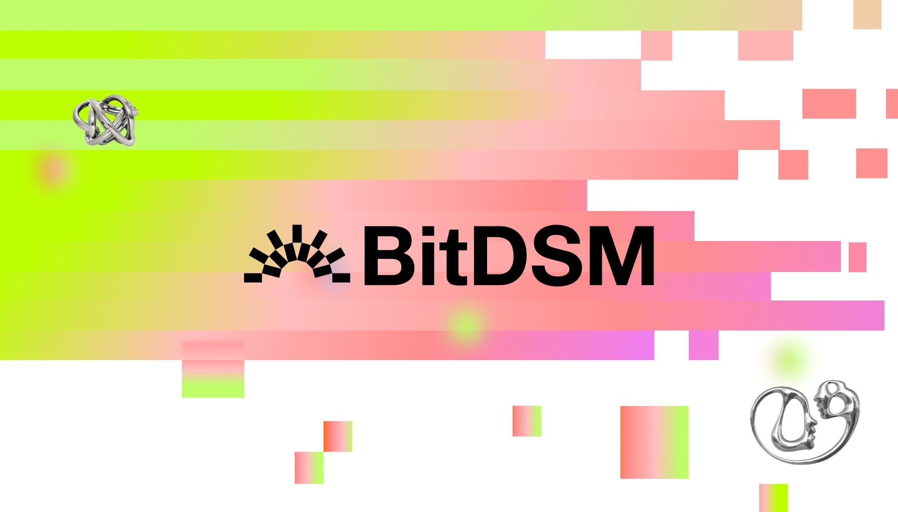

## BitDSM : Bitcoin Delegated Staking Mechanism


**BitDSM brings native Bitcoin delegation to ethereum applications.**

The BitcoinPod (BOD) is the core component of BitDSM, modeled after the EigenPod concept. A BOD is a non-custodial vault on the Bitcoin network, created using a P2WSH bitcoin address. The primary objective of the BitcoinPod is to ensure that a smart contract can slash the BOD for predetermined conditions for the value already held in the BitcoinPod or set to be processed through it. 

To accomplish this, BOD:
- function as the withdrawal address for one or more PoS validators managed by the BOD Owner
- verify pre-signed unbonding transactions from the source chain
- continuously monitor the Bitcoin blockchain to track the status of all BitcoinPods
- provide a delegation mechanism to other smart contracts via BOD manager. 

A BOD can be stateful or stateless, ie, either the bitcoins are held in it or the BOD is set as a withdrawal/unbonding address for a PoS validator on another chain. 

BOD is not a bridge nor does it mint any ERC-20. It is merely a way to delegate your spending authority to a smart contract. This enables other financial applications to be built on top of it like:
1. LSTs: PoS validators using Bitcoin to secure their chains can set withdrawal address as the BOD to mint an LST on ethereum. 
2. Lending/Borrowing: BOD can be locked as the collateral for borrowing a stable asset on Ethereum. 
3. Stable Coin: BOD can act as a CDP to mint a stable asset.
4. Insurance: BOD can act as an insurance for a BTC Bridge on Ethereum. 
5. BTC Bridge: BOD can act as a deposit address for minting a wrapped version of Bitcoin on Ethereum. 

BitcoinPods are bootstrapped using restaked security available to the AVS of Eigenlayer. BitcoinPods can be issued by operator sets with predetermined independent tasks, and can be secured either by an insurance built using BitDSM or with LRTs on Ethereum.

Front end link: https://bitdsm.vercel.app/

## Usage

### Build

```shell
$ forge build
```

### Test

```shell
$ forge test
```

### Format

```shell
$ forge fmt
```

### Gas Snapshots

```shell
$ forge snapshot
```

### Anvil

```shell
$ anvil
```

### Deploy

```shell
$ forge script script/deploy.s.sol:DeployScript --fork-url http://localhost:8545 --broadcast --private-key $PRIVATE_KEY
```

### To-Do
EigenLayer AVS deployment and operator registration.

```shell
$ forge --help
$ anvil --help
$ cast --help
```

## Deployment

```shell
$ forge script script/DeployBitDSM.s.sol:DeployBitDSM --fork-url http://localhost:8545 --broadcast --private-key $PRIVATE_KEY
```

## Existing Holesky Testnet Deployment 
 
| Contract Name                               | Holesky Address                                                                                                                 | 
| -------------                               | --------------------------------------------------------------------                                                            |
| ProxyAdmin                                  | [0xc8a51779c4d6365dd5fc4779a6518fc1598d1654](https://holesky.etherscan.io/address/0xc8a51779c4d6365dd5fc4779a6518fc1598d1654)   |
| BitDSMRegistry                              | [0xba3c98e3d60871f92d1c8890a13207fe46534641](https://holesky.etherscan.io/address/0xba3c98e3d60871f92d1c8890a13207fe46534641)   |
| BitDSMRegistryImplementation                | [0x37e04ac839c85e472310ff592b83e3f15e9920ec](https://holesky.etherscan.io/address/0x37e04ac839c85e472310ff592b83e3f15e9920ec)   |
| BitDSmServiceManager                        | [0x7238717bcf57fa8dcfece86f827e05a1ad4bf6b1](https://holesky.etherscan.io/address/0x7238717bcf57fa8dcfece86f827e05a1ad4bf6b1)   |
| BitDSMServiceManagerImplementation          | [0xfadca4a8774deaf364fa92d62054430ff76b3e97](https://holesky.etherscan.io/address/0xfadca4a8774deaf364fa92d62054430ff76b3e97)   |
| AppRegistry                                 | [0x91677dd787cd9056c5805cbb74e271fd83d88e61](https://holesky.etherscan.io/address/0x91677dd787cd9056c5805cbb74e271fd83d88e61)   |   
| AppRegistryImplementation                   | [0x25dd3fc30f59f240cfccfd893340f9cb9e365d75](https://holesky.etherscan.io/address/0x25dd3fc30f59f240cfccfd893340f9cb9e365d75)   |
| BitcoinPodManager                           | [0x96eae70bc21925dde05602c87c4483579205b1f6](https://holesky.etherscan.io/address/0x96eae70bc21925dde05602c87c4483579205b1f6)   |
| BitcoinPodManagerImplementation             | [0x49741f924ef91b14184ebe38b952f3ddf09008be](https://holesky.etherscan.io/address/0x49741f924ef91b14184ebe38b952f3ddf09008be)   |

Please see [Current Testnet Deployment](https://github.com/Layr-Labs/eigenlayer-contracts?tab=readme-ov-file#current-testnet-deployment) for additional deployed addresses of core EigenLayer contracts.


## Access Deployment Files 
Contract deployment files including the abi's can be found at the following address. 

```
DEPLOYMENT_FILES_DIR=contracts/script/output/${CHAINID}
```
